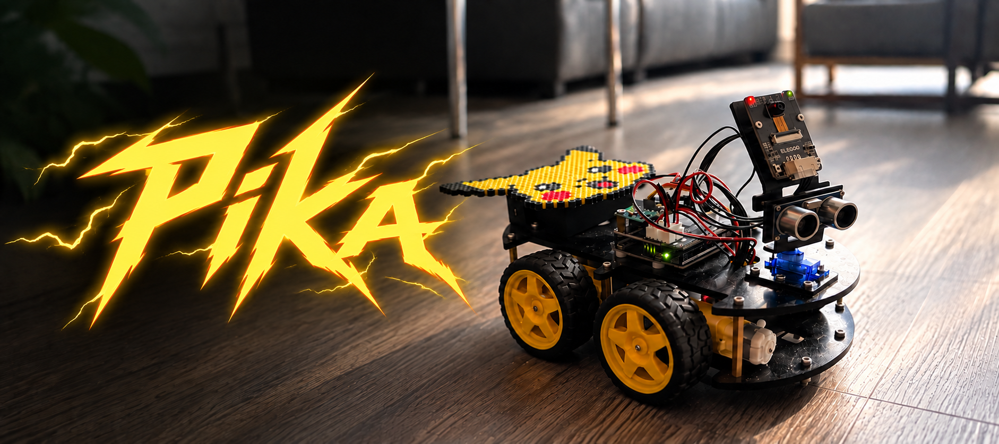

<p align="center">
  
</p>

# pika

**An ELEGOO Smart Robot Car Kit V4, being turned step by step into an autonomous car.**
Pika is the kit's UNO R3 and ESP32-S3 camera module with modified firmware on
both, driven from a Mac over home Wi-Fi by Python tools that read its sonar,
gyro and camera.

This is an evolving project. What works today: driving over Wi-Fi without
losing the Mac's internet, a browser controller with live video, gyro-closed
turns that land within 1.5°, VFH-lite reactive roaming, and a sonar radar
view (so far checked on a replayed log). What is still in progress: smooth autonomous navigation, going around
an obstacle to reach a goal, and a TF-Luna lidar (bring-up paused). Each
autonomy mode below says plainly how far it has been verified.
[todo.md](todo.md) has the open tasks and [HANDOVER.md](HANDOVER.md) the
detailed hardware state.

- [What Pika does](#what-pika-does)
- [Where it's heading](#where-its-heading)
- [Hardware](#hardware)
- [Get started](#get-started)
- [UNO firmware](#uno-firmware)
- [Autonomy modes](#autonomy-modes)
- [Wire protocol](#wire-protocol)
- [Repository guide](#repository-guide)
- [Development](#development)
- [Credits](#credits)

## What Pika does

- **Drives over home Wi-Fi.** The stock camera firmware runs its own access
  point, so a laptop that joins it loses internet. `firmware/camera_s3` joins
  the home network instead and keeps the stock wire protocol, so the ELEGOO
  phone app still works and `tools/car.py` drives the car while the Mac stays
  online.
- **Has a browser controller.** `tools/controller.py` serves live video, a
  hold-to-drive pad, speed, camera pan and straight-trim sliders, and sensor
  readouts on localhost.
- **Turns and drives precisely.** `tools/precision.py` closes turns on the gyro
  (0.3 to 1.5° error on 90° and 180°) and short drives on the sonar (0 to 4 cm
  on 30 to 50 cm legs), measured 2026-09-22.
- **Roams.** `tools/roam.py` is VFH-lite reactive roaming with smooth arcs. The
  owner likes how it drives best. It still spins at random when blocked
  ([todo.md](todo.md), task c).
- **Shows its sonar.** `tools/sonar_feed.py` draws a radar view from a
  controller's log. So far it has been checked on a replayed log, not a live
  drive.
- **Streams telemetry.** The modified UNO firmware pushes distance, gyro
  heading, line and ground sensors, battery voltage and the pan angle about 12
  times a second, and pans the sonar without blocking the wheels.

## Where it's heading

The owner's goals, in order: control the car from the Mac (done), autonomous
roaming as fast and smooth as possible (in progress), then a digital map of
every open room in the house.

- **Smooth navigation.** The newer stream-based controllers stop too often or
  freeze on no-echo readings in a real room. Deciding how to treat no-echo is
  the open question.
- **Obstacle go-around.** Bug-style: drive to a goal, meet the kitchen island,
  follow its edges with the sonar pointed sideways, and rejoin the goal line.
- **Sonar center calibration.** The servo's commanded 90° is not physically
  straight. The controller's Sonar front panel now sets and stores the
  offset: front is 95° raw, set by the owner on 2026-09-23.
- **Lidar.** A TF-Luna single-beam lidar on a separate Mega 2560 is paused
  mid bring-up. A single beam still needs a scanning and steering strategy; it
  does not by itself fix jerky driving, and the sonar map is a dead end for
  reconstructing a room.

## Hardware

| Part | Notes |
|---|---|
| Camera board | ESP32-S3-WROOM-1, OV3660 sensor, 8 MB flash, 8 MB octal PSRAM, USB-C on the back. Relays JSON frames between Wi-Fi and the UNO. |
| UNO R3 | ELEGOO's stock sketch with the mods in [UNO firmware](#uno-firmware). |
| Shield | The 2020 TB6612 board: standby on pin 3 must be high, and motor group A's direction is inverted relative to ELEGOO's V0 source, which targets the newer DRV8835 shield. |
| Sensors | Ultrasonic sonar on a pan servo (10 to 170°), MPU6050 gyro, three line sensors, ground sensor. The line sensors are not reliable stair detectors. |
| Battery | 2000 mAh Li-ion. **A flat battery stops the motors while the UNO, sonar, gyro and camera keep working**, which looks exactly like broken motor code. Charge it before believing any motion result. The firmware warns (red LED) below 7.0 V. |

The camera has one TCP client slot and one video viewer at a time. Stop the
browser controller before running an autonomous tool.

## Get started

### Flash the camera firmware

The camera board is flashed off the car.

1. `cp firmware/camera_s3/secrets.h.example firmware/camera_s3/secrets.h`
   and fill in a 2.4 GHz SSID and password. `secrets.h` is gitignored.
2. Unscrew the camera board from its bracket. Plug a USB-A to USB-C cable
   from a dock USB-A port into the socket on the back. A C-to-C cable from
   the Mac does not power it.
3. Put it in download mode: hold BOOT, tap RST, release BOOT. It enumerates
   as `USB JTAG/serial debug unit`, `/dev/cu.usbmodemNNNN`.
4. Flash and verify through hwlog (github.com/gurul/hardware-logging):

   ```sh
   tools/flash_camera.sh /dev/cu.usbmodemNNNN
   ```

   The first run backs up the factory flash to `firmware/build-archive/`.
   Restore with `esptool write-flash 0 <backup.bin>`.
5. Screw it back on, reconnect the 4-pin cable, flip the shield's UART
   switch to the camera position, power the car on.

Board options (from ELEGOO's Notes.txt): ESP32S3 Dev Module, USB CDC on boot,
8 MB flash QIO, partition `8M with spiffs`, OPI PSRAM.

Gotchas, all hit on 2026-09-22:

- **The buddy daemon steals this port.** Its `CC_BUDDY_SERIAL_PORT` glob is
  `/dev/cu.usbmodem*` and it prefers any ESP32-S3. Pause it before touching
  the camera board: `launchctl bootout gui/$(id -u)/com.github.cc-buddy-bridge.daemon`.
  Its reconnect attempts also toggle DTR/RTS, which on this port are the boot
  straps, so it can hold the chip in download mode.
- **esptool's RTS hard reset leaves the S3 in download mode** on the native
  USB port. Use `--after watchdog-reset`, or tap RST by hand. When reading
  boot output with pyserial, set `dtr=False, rts=False` before `open()`.
- **The stub's bulk `read-flash` stalls** over the native USB port. Back up in
  1 MB chunks with `--no-stub`.
- **Firmware version matters.** The stock UNO sketch on this car prints
  `MPU6050_chip_id: 52` (2020 branch). ELEGOO's 2.1.2 rewrite prints
  `Smart Robot Car V4.0 - System Ready`. Same JSON protocol.

### The UART switch on the shield

The shield's UART header wires the camera module's TX to the UNO's RX through
the slide switch next to the header. One position connects the camera module
(wireless control, app, FPV). The other disconnects it so the UNO's USB port
can talk to the board (uploading sketches, `arduino-cli monitor`). The UNO
always transmits to USB; only its receive side is switched. Flip it by hand
for every reflash.

Wired session (switch in the USB position):

```sh
arduino-cli monitor -p /dev/cu.usbserial-3130 -c baudrate=9600
```

Opening the port resets the UNO; it prints `MPU6050_chip_id: 52` and waits.

### Drive it over Wi-Fi

```sh
tools/car.py dist
tools/car.py "fwd 120 800" "left 140 600" stop
tools/car.py                      # interactive prompt
```

`--host` defaults to `elegoo-car.local`; pass the IP if mDNS is blocked.
Video: `http://elegoo-car.local:81/stream` (MJPEG), `http://elegoo-car.local/capture`
(single JPEG), `http://elegoo-car.local/drive` (browser drive page with
stream). The board also keeps the stock open hotspot `ELEGOO-<mac>` at
192.168.4.1 for the phone app.

### Browser controller

```sh
tools/controller.py            # opens http://127.0.0.1:8765/
```

Live video, a hold-to-drive pad (or WASD / arrows, Space stops), speed,
camera-pan and straight-trim sliders (trim is saved to `calibration.json`),
distance and line-sensor readouts, a sonar radar, and the autonomous modes.
The radar plots each distance reading at the angle the pan servo faced, which
fades after 10 s; no echo shows as a grey tick at the rim, not as clear space.
**Swivel** mode sweeps the sonar from 10° to 170° and back, reading distance at
every stop, and keeps sweeping while you drive. Its speed slider (1 to 5)
trades detail for sweep time: 1 is 10° steps with a 400 ms pause, 5 is 30°
steps. Each stop costs one servo and one distance round trip, 0.3 to 0.6 s
each, measured 2026-09-23. The label shows the measured seconds per sweep.
Moving the pan slider or picking another mode ends the swivel.

**Sonar front** sets the servo angle that counts as straight ahead. The arrow
buttons turn the sonar 1° (◀ ▶) or 5° (◀◀ ▶▶) in raw servo degrees, and
holding one keeps turning; Shift + ←/→ does the same from the keyboard. Aim at
a wall or box straight down the car's axis and nudge to the shortest reading,
then **Save as front**. That writes `servo_center_deg` to `calibration.json`
with the date and the distance read at save time. `tools/car.py` adds the
offset to every outgoing pan angle (`N=5`, `N=28`) and maps telemetry pan back,
so 90 means straight ahead in every tool; a frame with `"raw": true` skips it.
Releasing a
button sends stop. Each drive pulse is a 450 ms timed move, and forward uses
`N=4` with a 0.7 s server deadman, so a dropped connection stops the car
within half a second. It holds the car's single TCP slot.

It has to run locally: browsers refuse to let an https page call a plain-http
device on the LAN, so a hosted page cannot reach the car.

### Toolchain note

Arduino ships `ctags` for macOS only as an x86 binary. On a Mac without
Rosetta, `arduino-cli compile` fails with `bad CPU type in executable`.
Fix: build github.com/arduino/ctags natively (rename its `__unused__` macro
first, it clashes with the SDK's dirent.h) and copy the result over
`~/Library/Arduino15/packages/builtin/tools/ctags/5.8-arduino11/ctags`.

## UNO firmware

`firmware/uno_v4_mod/` is ELEGOO's stock `SmartRobotCarV4.0_V0_20210104`
sketch with the changes below, each marked `mod:` in the source. The running
UNO has v4, flashed 2026-09-22 and read back byte for byte.

| Change | Effect |
|---|---|
| sonar cap 150 to 400 cm, 30 ms echo timeout | walls visible from across a room; a miss returns at once instead of stalling the UNO for a second |
| `N=24` gyro heading | replies `{H_<yaw*10>}`, tenths of a degree, integrated every 10 ms. A left turn decreases yaw on this car (`yaw_left_sign = -1` in `calibration.json`) |
| `N=25` telemetry stream, `D1` = period ms (0 off) | pushes `{T_<dist>_<yaw*10>_<L>_<M>_<R>_<ground>_<mV>}` unsolicited; no round trips. The camera bridge drops about a quarter of the frames, so request 70 ms to receive about 12 per second |
| `N=25 D1=100 D2=1` (v4) | opt-in ten-field telemetry `{T_dist_yaw10_L_M_R_ground_mV_pan_seq_sample_ms}`, used by the stream controllers |
| `N=28 D1=<10..170>` (v4) | asynchronous pan in whole degrees; keeps wheel mode and gyro updates running |
| servo in single degrees, 200 ms settle | `N=5 D2` is degrees 10..170; sweeps are finer and twice as fast |
| wheel-speed deadman | `N=4` drive stops itself 1.5 s after the last renewal (500 ms in active mode) |
| `N=26` gyro recalibration | re-zeroes the gyro; the car must be still, and not just set down (that gave 7 deg/s drift) |
| `N=27` battery voltage | replies millivolts; also a stream field |
| TB6612 shield pin map | standby pin 3 driven high (no motor runs otherwise) and group A's direction polarity inverted. `-DSHIELD_DRV8835` restores ELEGOO's map |

In the v4 stream the pan field is the commanded angle, negative while the
servo settles; it is not an encoder reading. Sequence and sample milliseconds
wrap at 65536. In active mode a missing echo is 0 (unknown); in the older
reply format it is 400. Legacy `N=5` and seven-field telemetry still work for
older tools. Everything else, including the phone app protocol, is unchanged.

### Build and flash

UNO on its own USB, shield UART switch in the USB position:

```sh
arduino-cli core install arduino:avr@1.8.3   # 1.8.8 makes this sketch restart silently during init
arduino-cli lib install Servo@1.1.8          # FastLED comes from ELEGOO's addLibrary zip
.venv/bin/python scripts/check_uno_build.py      # compiles with build/avr-bin8, gcc 8 + -mcall-prologues
.venv/bin/python scripts/check_uno_backup.py     # reads the factory flash twice, keeps uno-factory-<date>.hex
avrdude -p m328p -c arduino -P /dev/cu.usbserial-XXXX -b 115200 -U flash:w:build/uno_v4_mod/uno_v4_mod.ino.hex:i
```

Restore the factory firmware the same way with
`firmware/build-archive/uno-factory-<date>.hex`.

Never send a motion command while the UNO is on USB: the cable is short.
Flash, run static checks, unplug, flip the switch back, then test motion
over Wi-Fi. Do not run `scripts/check_uno_protocol.py` on USB: it contains a
motor command despite its name.

Toolchain workaround: Arduino ships its AVR compiler and avrdude for macOS as
x86 binaries, which this Mac cannot run. `brew trust osx-cross/avr && brew
install avr-gcc@8 avrdude` gives native ones; `build/avr-bin8/` symlinks the
compiler and binutils into one directory that arduino-cli's `compiler.path`
build property points at. gcc 8 with `-mcall-prologues` is the only
combination that fits the sketch in 32 KB (31.3 KB); gcc 9 lands at 33.3 KB
even for the untouched stock sketch. (avr-gcc@9 and @12 are also installed;
unused.) To fit v4, four integer `sprintf` calls became `itoa`. The AVR core
must be 1.8.3: on 1.8.8 the untouched stock sketch jumps back to reset about a
second into init, with no reset cause and no unhandled interrupt, on every
compiler tried. Diagnosed 2026-09-22.

Protocol traps: the per-motor command `N=1` zeroes the other group, so it
cannot drive both sides; use `N=2` or `N=4`. `N=2` timed moves ack at timer
expiry, not at receipt.

## Autonomy modes

All modes run on the Mac and talk to the car over Wi-Fi. Before any run: charge
the battery, unplug USB, set the UART switch to camera, stop other
controllers, and use a supervised, clear, level floor away from stairs.

| Mode | Tool | Status |
|---|---|---|
| Precise moves | `tools/precision.py` | Measured and repeatable |
| VFH-lite roaming | `tools/roam.py` | The owner's preferred drive; spins at random when blocked |
| Stream VFH + radar | `tools/stream_roam.py`, `tools/sonar_feed.py` | Offline checks pass; froze in a real room |
| Active sonar | `tools/active_roam.py` | Stop, scan, move; regressed from `roam.py` |
| Room mapping | `tools/explore.py` | Experimental; not adapted to the 400 cm firmware |

### Precise moves

```sh
.venv/bin/python tools/precision.py probe       # recalibrate gyro, learn yaw sign, check forward
.venv/bin/python tools/precision.py turn 90     # closed-loop turn, positive = left
.venv/bin/python tools/precision.py drive 40    # closed-loop distance toward whatever is ahead
.venv/bin/python tools/precision.py square 40   # 4 x (drive, turn 90 left), report closure
```

Measured 2026-09-22: turns land within 0.3 to 1.5° (90 and 180); drives stop
within 0 to 4 cm (30 to 50 cm legs). The sonar is very noisy while the motors
run (single readings jump by 50 to 100 cm), so a driving loop must ignore jumps
and require two agreeing readings before it stops. `square 40` has not
completed yet for lack of room (it needs 60 cm or more on every side).

### VFH-lite roaming

```sh
.venv/bin/python tools/roam.py --duration 60 --vmax 160
```

Borenstein and Koren's Vector Field Histogram in the VFH+ form: a decaying
polar histogram of obstacle density over the front 180° in 10° sectors, each
reading enlarged by `asin((robot_radius + safety) / range)`, binarised with
hysteresis, and a steering cost that weighs the target, current heading and
previous choice. Speed shrinks with density ahead; steering is a differential
wheel pair (a smooth arc). It treats no-echo as open, which is why it keeps
moving. It predates the stream firmware: it polls distance and spins by time,
not by gyro. Known faults (random spin direction, false "lifted" stops) are
in [todo.md](todo.md), task c.

### Stream VFH and the live radar

`tools/stream_roam.py` keeps `roam.py`'s histogram and steering cost on the v4
angle-tagged telemetry and nonblocking pan. It drives in continuous curves by
slowing one wheel. Each wheel is at or above the motors' moving floor (70 PWM)
or at 0 for a deliberate pivot, never in between, because a wheel in between
stalls. While driving straight it glances 20 to 40° off center, only when the
glance fits the forward-clearance budget, and not while turning; it sweeps
wider only when stopped and starts moving only once the sonar faces forward
again. Side readings age by the car's actual path. It keeps `active_roam.py`'s
stop protections (close obstacle, stale telemetry, ground loss, estop). No-echo
counts as unknown, never clear. Before any run it checks the gyro is steady
while stopped, recalibrates once if not, and aborts if it still drifts. Side
glances are scheduled by staleness weighted toward the chosen path (Finean et
al., RA-L 2021, arXiv 2109.04721); that gaze is untested on hardware.

```sh
.venv/bin/python tools/stream_roam.py --observe --duration 15   # no wheel commands
.venv/bin/python tools/stream_roam.py --duration 60 --vmax 110
```

Logs go to `build/runs/vfh-<timestamp>/`. To watch the sonar live, give both
processes the same `--run-dir`, start the feed first (it waits for the log),
then open http://127.0.0.1:8767/:

```sh
.venv/bin/python tools/sonar_feed.py --run-dir build/runs/vfh-live
.venv/bin/python tools/stream_roam.py --observe --duration 60 --run-dir build/runs/vfh-live
```

`sonar_feed.py` never connects to the car. It tails the controller's
`log.jsonl` and serves [web/sonar-feed.html](web/sonar-feed.html) on loopback
only: a green semicircle, a sweep arm and red returns from the last 2 s. It
labels settling, unknown (no-echo) and stale (older than 0.75 s) data and never
shows old data as live.

Status: the simulation models wheel stiction below 55 PWM and still stops about
6 to 7 times per 35 s, each time turning away from an obstacle into no-echo
space; the noisy-obstacle case gets past in 6 of 10 seeds. That gate is unmet
([.unlazy/vfh-restore/GATES.md](.unlazy/vfh-restore/GATES.md), G2). A 4-minute
real drive froze on `unknown_ahead` because most forward readings were no-echo.
The radar has been checked in Chrome on a replayed real log, not on a live
car.

### Active sonar

`tools/active_roam.py` looks for openings with recent angle-tagged sonar
observations before steering: it searches outward with the pan servo, rechecks
forward, limits acceleration, and stops when no observed braking corridor
remains. Short turning pulses recover after a side opening is confirmed; it
never reverses blindly. It needs the v4 extended stream and refuses to drive
without it.

Before committing to a heading it checks that the move and its side glances fit
the sensing-time budget; rejected routes widen the scan. A missing pan ack
holds the car stopped until fresh angle-tagged telemetry confirms the pan
([.unlazy/stall-fix/GATES.md](.unlazy/stall-fix/GATES.md)).

```sh
.venv/bin/python tools/active_roam.py --observe --duration 15
.venv/bin/python tools/active_roam.py --duration 20 --vmax 110
```

`--observe` pans the sensor but sends no wheel commands. Ctrl-C stops a live
run. Every exit attempts a stop, disables streaming and closes the connection.
Logs go to `build/runs/active-<timestamp>/`. Battery voltage is recorded, but
the 7.0 V driving cutoff was removed at the owner's request.

Status: in a 145 s real run the car moved in short bursts separated by swivels
and stops, and drove poorly in a straight line. Simulation is not evidence of
real-world smoothness, and the faster-wheel stress case still gets stuck.
Research and evidence: [RESEARCH-active-roam.md](RESEARCH-active-roam.md),
[RESEARCH-stall-fix.md](RESEARCH-stall-fix.md),
[GATES-active-roam.md](GATES-active-roam.md). Replay:
`build/active-roam-simulation/replay.html` (generated by
`scripts/render_roam_replay.py`).

`tools/dash.py` (12 Hz stream, heading hold, gyro turns when blocked) is an
earlier attempt the owner rejected: its stop-glance-turn cycle was jerky.

### Map the room

Experimental. Written for the stock 150 cm sonar cap and not yet adapted to
the 400 cm firmware, gyro heading or stream. One four-minute run produced a
blob, recorded unmet in [GATES.md](GATES.md) (G7).

```sh
.venv/bin/python tools/explore.py --duration 240
open http://127.0.0.1:8766/          # live map, pose trail, latest frame
```

The car maps by stop-and-scan. Each cycle it sweeps the sonar across 180° on
the pan servo (17 readings, 10 to 170° in 10° steps, about 15 s), localizes
that sweep against the map so far, adds it to the map, picks the nearest
frontier (free space touching unknown space), turns toward it, and drives at
most one hop (35 cm). It stops when no reachable frontier is left or the
duration runs out. For a whole floor, raise `--duration` (an hour is realistic)
and leave the doors open.

Map: a log-odds occupancy grid, 5 cm cells, 20 m square by default (`--size`,
`--cell`). The sonar model follows Moravec and Elfes: the cone in front of a
reading is marked free, the arc at the measured range occupied, weighted
toward the beam axis. A reading of 150 cm means "no echo" (the stock firmware's
cap) and marks the near cone weakly free.

Pose: the car has no odometry. Moves are predicted from `calibration.json`
and corrected by a beam-model scan matcher that ray-casts the map the way the
sonar sees it. On the simulator: about 6 to 8 cm and 3 to 6° per step, heading
being the weak axis with 17 beams.

Safety envelope (`tools/safety.py`, the only code that sends motion frames):
timed pulses of at most 450 ms, so the UNO stops itself if the link dies;
forward refused under 25 cm ahead or when the last distance reading is older
than 1 s; a floor-sensor cliff guard before every forward hop; e-stop on `q`
or space in the terminal, latched for the rest of the run. Vision hazards also
veto a hop.

Calibration, once, with the car on the floor:

```sh
.venv/bin/python tools/sonar.py calibrate-forward   # face a wall 60..149 cm away
.venv/bin/python tools/sonar.py calibrate-turn      # spins left once, needs features around
```

Run directory (`build/runs/<stamp>/`): `log.jsonl` every event with a
timestamp (scan, localize, plan, pulse, stop, deny, cliff, vision, fault);
`poses.jsonl` one pose per cycle; `map.png` redrawn every cycle (white free,
black occupied, grey unknown, cyan frontier, orange path, blue trail, red
robot); `map.npy` the log-odds grid; `frames/` a camera frame per cycle;
`summary.json` at the end.

Fault injection, for the safety gates: `--fault stale-at=<s>` freezes the
distance feed at that second, `--fault estop-at=<s>` raises the e-stop. Use
`--dry-run` to run the whole loop without sending a motion frame.

Vision: with `OPENAI_API_KEY` in `~/.config/car/env` (falls back to the buddy
config), each cycle's frame goes to a vision model (`CAR_VISION_MODEL`,
default `gpt-5-mini`) that returns the room name, hazards ahead and open
doorways. Room names label the map (a 2-of-3 vote smooths flip-flops); a
hazard reported ahead within 1.5 m vetoes the next hop. Without a key the run
proceeds on sonar alone and says so in the log.

## Wire protocol

The UNO reads JSON frames at 9600 baud and replies with `{<H>_ok}`,
`{<H>_true}` or `{<H>_<value>}`. The stock frames below still work on the
modified firmware; its additions are in [UNO firmware](#uno-firmware).

| Frame | Meaning |
|---|---|
| `{"H":"1","N":21,"D1":2}` | ultrasonic distance in cm |
| `{"H":"2","N":22,"D1":1}` | middle line sensor (D1 0/1/2 = L/M/R) |
| `{"H":"3","N":5,"D1":1,"D2":90}` | gimbal servo to 90 degrees |
| `{"H":"4","N":2,"D1":3,"D2":120,"T":800}` | forward, speed 120, 800 ms |
| `{"H":"5","N":101,"D1":2}` | mode: 1 line tracking, 2 obstacle avoidance, 3 follow |
| `{"H":"6","N":100}` | stop, standby |

Direction codes for `D1` on N=2 and N=3: 1 left, 2 right, 3 forward, 4 back.
`N=23` replies `_false` while the car is on the ground.

Over Wi-Fi the camera module relays these frames on TCP port 100, sends
`{Heartbeat}` once a second, and drops a client that misses three. Reply with
`{Heartbeat}`; `car.py` does this for you.

## Repository guide

```text
firmware/camera_s3/      ESP32-S3 camera firmware (station mode), the one that is flashed; see ORIGIN.md
firmware/camera_sta/     earlier attempt for the older ESP32-WROVER camera board; compiles, never flashed
firmware/uno_v4_mod/     modified UNO sketch (v4)
firmware/mega_lidar/     TF-Luna reader for a Mega 2560; unverified draft, paused
firmware/build-archive/  factory flash backups, gitignored
tools/car.py             Wi-Fi command client (TCP port 100), parses both telemetry formats
tools/controller.py      browser controller: serves controller.html on localhost, proxies to TCP 100
tools/controller.html    the controller page
tools/safety.py          sends motion frames: pulse cap, forward veto, watchdog, e-stop
tools/precision.py       gyro-closed turns, sonar-closed drives
tools/roam.py            VFH-lite roaming
tools/stream_roam.py     VFH on the v4 stream, continuous curves
tools/active_roam.py     active sonar roaming (look before steering)
tools/sonar_feed.py      read-only radar server; page in web/sonar-feed.html
tools/dash.py            earlier fast-drive attempt, retired
tools/explore.py         stop-and-scan mapping, frontier exploration, run logs
tools/mapping.py         log-odds occupancy grid, beam-model scan matcher, frontier planner
tools/sonar.py           servo sweeps and motion calibration
tools/vision.py          room label, hazards and doorways from the camera via OpenAI
tools/flash_camera.sh    compile + hwlog flash + boot verification
tools/tests/             unit tests
scripts/                 gate checks, simulations and replay rendering
calibration.json         measured speeds, turn rate, yaw sign, trim, servo center
.claude/skills/          hwlog agent skill, installed by `hwlog init`
build/                   arduino-cli output and run logs, gitignored
```

Measured calibration (`calibration.json`): 22.5 cm/s forward at speed 120
(older sweep-based number, probably low), 189.5°/s turning at speed 140 from
the gyro.

## Development

The project Python is `.venv/` (uv, Python 3.12: numpy, pillow, openai,
pyserial). Offline checks need no car:

```sh
.venv/bin/python -m unittest discover -s tools/tests -t .
.venv/bin/python scripts/check_stream_roam.py tests
.venv/bin/python scripts/check_stream_roam.py simulation
.venv/bin/python scripts/check_active_roam.py planner
.venv/bin/python scripts/check_active_roam.py integration
.venv/bin/python scripts/check_active_roam.py firmware
.venv/bin/python scripts/check_active_roam.py simulation
.venv/bin/python scripts/check_active_stall.py
.venv/bin/python scripts/render_roam_replay.py
.venv/bin/python scripts/check_readme.py && .venv/bin/python scripts/check_readme.py --uno
```

Acceptance ledgers record which claims have evidence: [GATES.md](GATES.md)
(mapping), [GATES-uno.md](GATES-uno.md) (firmware),
[GATES-active-roam.md](GATES-active-roam.md), and `.unlazy/*/GATES.md` for
later work. A passing simulation is not evidence of smooth driving on a real
floor. [HANDOVER.md](HANDOVER.md) is the running hardware state and trap list.

## Credits

- [ELEGOO](https://www.elegoo.com/) for the Smart Robot Car Kit V4 and its
  stock UNO and camera firmware, which this project modifies.
- github.com/ekulkisnek/elegoo-car-custom-tools for the station-mode patch of
  ELEGOO's camera sketch ([ORIGIN.md](firmware/camera_s3/ORIGIN.md)).
- J. Borenstein and Y. Koren, the Vector Field Histogram (VFH), used by
  `roam.py` and `stream_roam.py`.
- H. Moravec and A. Elfes, the sonar occupancy-grid model used by `mapping.py`.
- M. N. Finean et al., RA-L 2021 (arXiv 2109.04721), for the gaze scheduling
  in `stream_roam.py`.
- [arduino/ctags](https://github.com/arduino/ctags), built natively for the
  toolchain fix.
